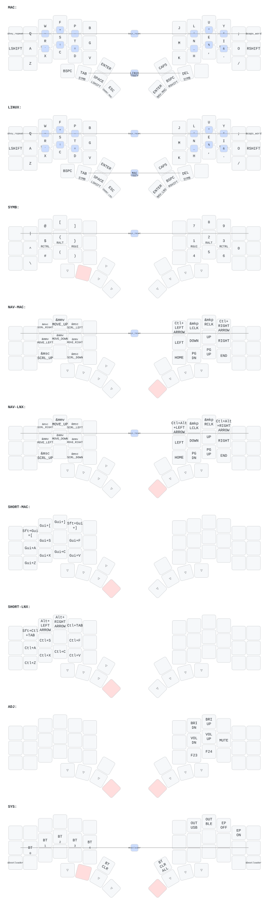
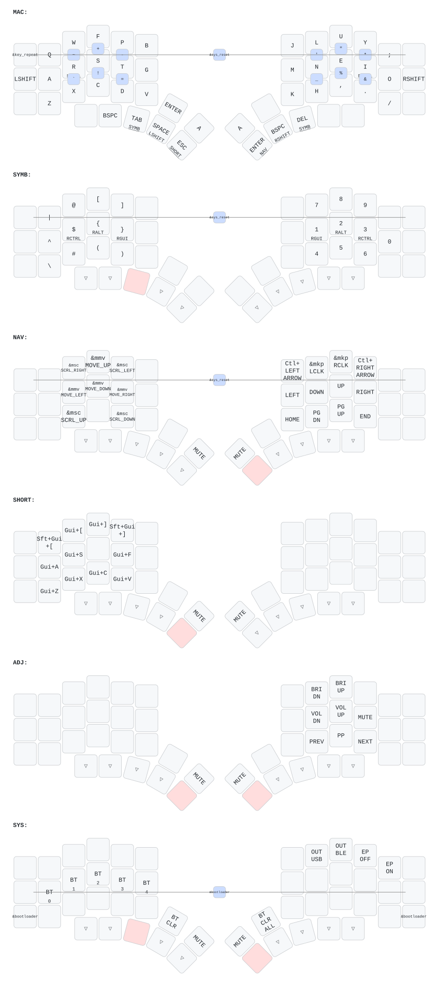

# ZMK Config


## Local ZMK Firmware Builds (Docker)

Build ZMK firmware locally without installing toolchains. Requires only Docker.

### Quick Start

```bash
# Build a specific keyboard
make hillside
make kyria

# See all available commands
make help
```

Firmware files appear in `firmwares/` at the repo root.

### Adding a New Keyboard

1. Add a `setup_<name>()` function in `build_setup.sh` defining the board+shield combos
2. Add the keyboard to the `case` statement in the main section
3. Add a Make target in `Makefile`

### Troubleshooting

Drop into an interactive shell inside the container:

```bash
make shell
```

Then run the build script manually:

```bash
KEYBOARD=hillside bash ./local-build/build_setup.sh
```

Save build output to a file:

```bash
make hillside > build_log.txt 2>&1
```

## Hillside46


## Kyria

